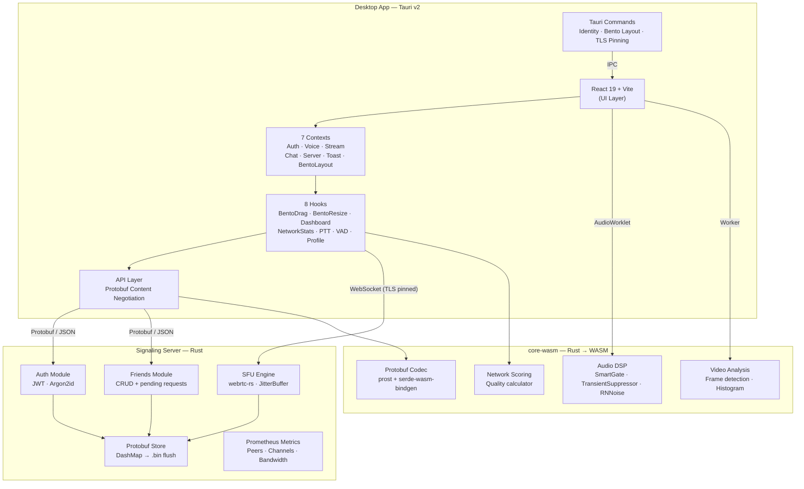
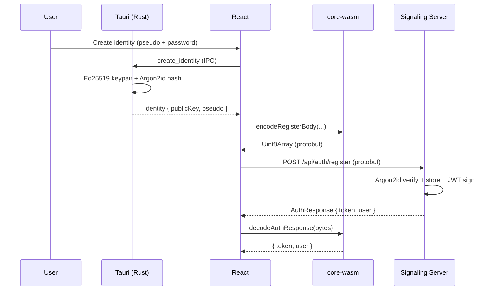
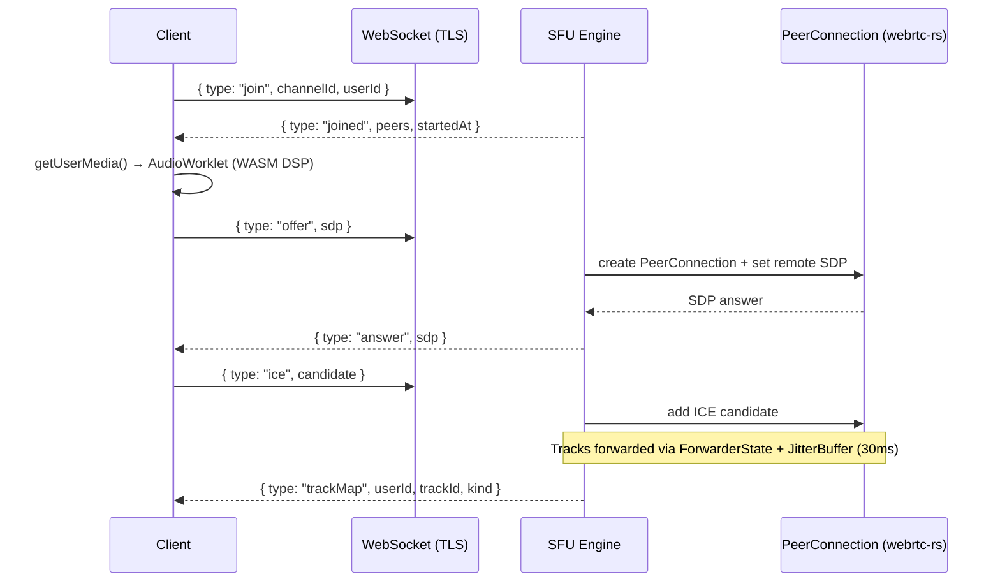
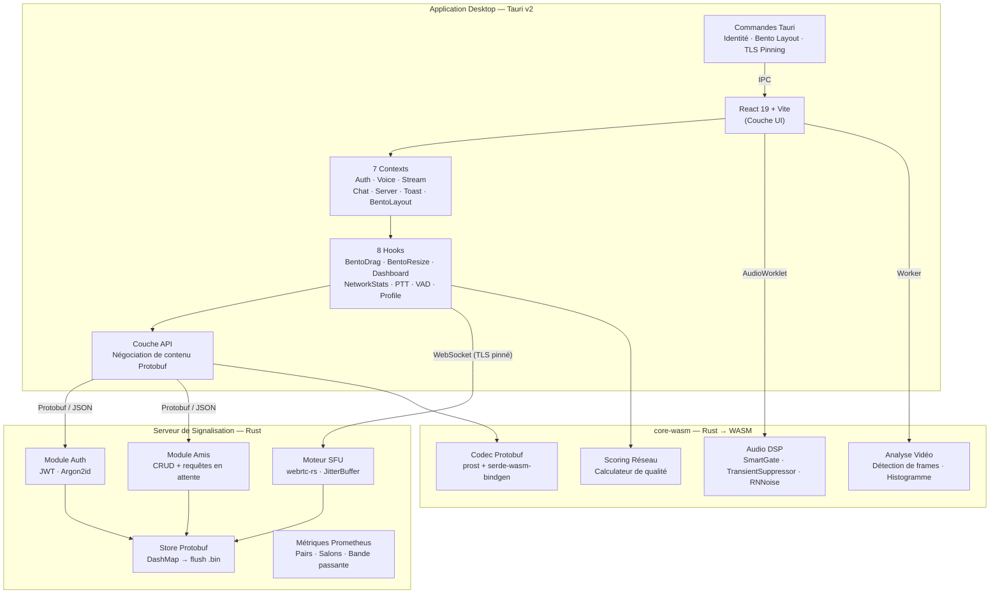
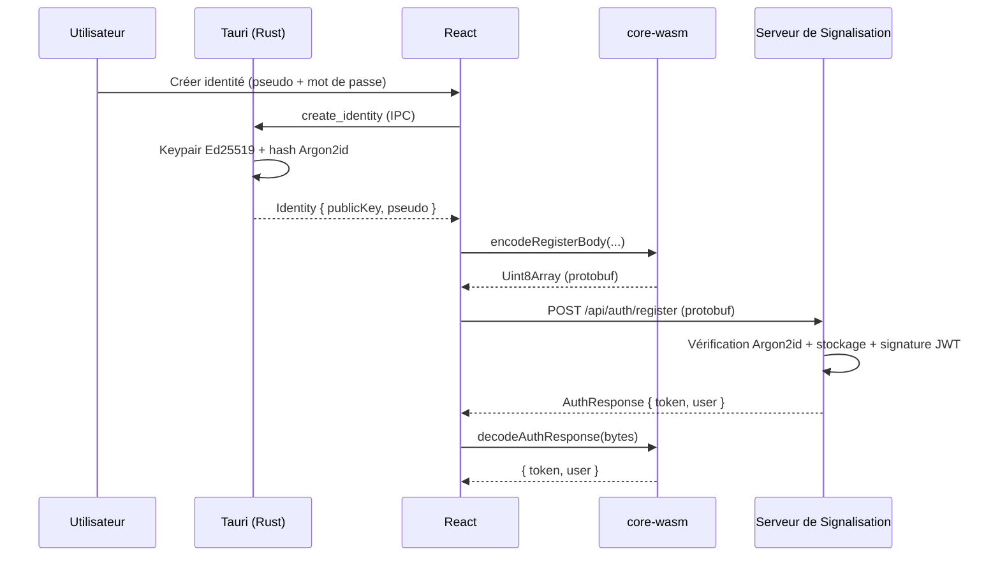
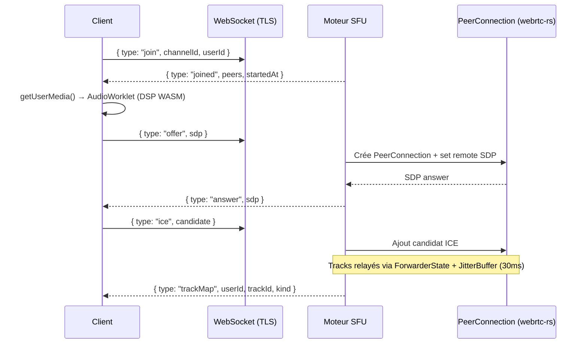

# Void

A cross-platform, high-performance voice & video client built with **Rust**, **WebAssembly**, **Tauri v2** and **React 19**.

## Architecture



## Tech Stack

| Layer | Technologies |
|---|---|
| **Desktop Shell** | Tauri v2, Rust, TLS Certificate Pinning |
| **Frontend** | React 19, TypeScript, TailwindCSS v4, Vite 7 |
| **Real-time Audio** | WebRTC, AudioWorklet, RNNoise, WASM DSP |
| **WASM Core** | Rust, wasm-bindgen, prost (protobuf) |
| **Signaling Server** | Axum, Tokio, webrtc-rs, DashMap |
| **Auth** | Ed25519 (local keypair), Argon2id, JWT HS256 |
| **Observability** | Prometheus, Grafana, Alertmanager |
| **Serialization** | Protobuf (prost) with JSON fallback |

## Monorepo Structure

```
void/
├── apps/desktop/              # Tauri + React + Vite desktop app
│   ├── src/                   # React frontend (contexts, hooks, components)
│   ├── src-tauri/             # Rust backend (identity, Bento layout, TLS)
│   └── public/worker/         # Compiled audio worklets
├── packages/
│   ├── core-wasm/             # Rust → WASM (DSP, codec, video, network)
│   └── signaling-server/      # Rust signaling + SFU + auth + friends
├── docker/                    # Prometheus, Grafana, Alertmanager configs
├── Cargo.toml                 # Rust workspace
└── pnpm-workspace.yaml        # pnpm workspace
```

## Key Flows

### Authentication



### Voice (SFU WebRTC)



## Quick Start

```sh
pnpm install
cd apps/desktop
pnpm dev
```

### Build WASM Core

```sh
cd packages/core-wasm
wasm-pack build --target web --out-dir ../../apps/desktop/src/pkg
```

### Build Audio Worklet

```sh
cd apps/desktop
pnpm build:worklet
```

### Native Desktop Build

```sh
pnpm tauri build
```

## Observability (Docker)

```sh
docker compose up -d
```

Starts Prometheus (`:9090`), Grafana (`:3000`), Alertmanager (`:9093`), Node Exporter (`:9100`).

## License

**Business Source License 1.1 (BSL-1.1)** — See [LICENSE](./LICENSE).

---

# Void (FR)

Client vocal et vidéo multiplateforme haute performance construit avec **Rust**, **WebAssembly**, **Tauri v2** et **React 19**.

## Architecture



## Stack Technique

| Couche | Technologies |
|---|---|
| **Shell Desktop** | Tauri v2, Rust, Certificate Pinning TLS |
| **Frontend** | React 19, TypeScript, TailwindCSS v4, Vite 7 |
| **Audio Temps Réel** | WebRTC, AudioWorklet, RNNoise, DSP WASM |
| **Noyau WASM** | Rust, wasm-bindgen, prost (protobuf) |
| **Serveur de Signalisation** | Axum, Tokio, webrtc-rs, DashMap |
| **Auth** | Ed25519 (keypair local), Argon2id, JWT HS256 |
| **Observabilité** | Prometheus, Grafana, Alertmanager |
| **Sérialisation** | Protobuf (prost) avec fallback JSON |

## Structure du Monorepo

```
void/
├── apps/desktop/              # App desktop Tauri + React + Vite
│   ├── src/                   # Frontend React (contexts, hooks, composants)
│   ├── src-tauri/             # Backend Rust (identité, Bento layout, TLS)
│   └── public/worker/         # Worklets audio compilés
├── packages/
│   ├── core-wasm/             # Rust → WASM (DSP, codec, vidéo, réseau)
│   └── signaling-server/      # Signalisation Rust + SFU + auth + amis
├── docker/                    # Configs Prometheus, Grafana, Alertmanager
├── Cargo.toml                 # Workspace Rust
└── pnpm-workspace.yaml        # Workspace pnpm
```

## Flux Principaux

### Authentification



### Voix (SFU WebRTC)



## Démarrage Rapide

```sh
pnpm install
cd apps/desktop
pnpm dev
```

### Compiler le Noyau WASM

```sh
cd packages/core-wasm
wasm-pack build --target web --out-dir ../../apps/desktop/src/pkg
```

### Compiler le Worklet Audio

```sh
cd apps/desktop
pnpm build:worklet
```

### Build Desktop Natif

```sh
pnpm tauri build
```

## Observabilité (Docker)

```sh
docker compose up -d
```

Lance Prometheus (`:9090`), Grafana (`:3000`), Alertmanager (`:9093`), Node Exporter (`:9100`).

## Licence

**Business Source License 1.1 (BSL-1.1)** — Voir [LICENSE](./LICENSE).
