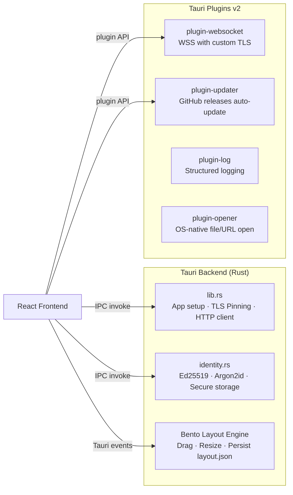
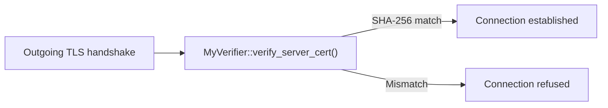
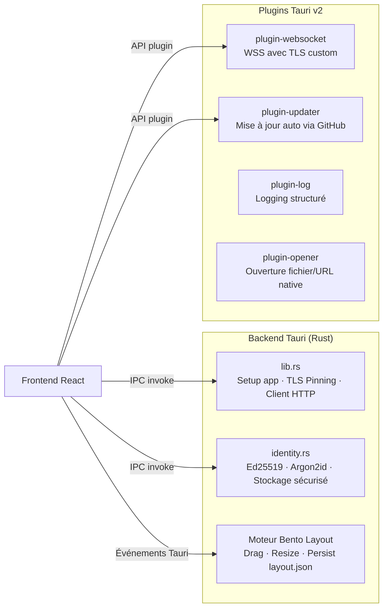

# Void — Tauri Backend

Rust-powered desktop backend using **Tauri v2**. Handles local identity management, TLS certificate pinning, and the Bento Layout engine.

## Architecture



## Tauri Commands

| Command | Module | Description |
|---|---|---|
| `create_identity` | `identity.rs` | Generates Ed25519 keypair, hashes password with Argon2id, persists to disk |
| `find_identity_by_pubkey` | `identity.rs` | Looks up an identity by its public key |
| `update_identity_pseudo` | `identity.rs` | Updates the display name of a stored identity |
| `update_identity_avatar` | `identity.rs` | Updates the avatar data of a stored identity |
| `recover_identity` | `identity.rs` | Recovers an identity using pseudo + password (Argon2id verification) |
| `call_signaling` | `lib.rs` | HTTP(S) request to the signaling server with TLS certificate pinning |

## TLS Certificate Pinning

The app embeds a SHA-256 fingerprint of the server certificate. All HTTPS/WSS connections verify the remote cert against the pinned hash via a custom `rustls::ServerCertVerifier` implementation (`MyVerifier`). This prevents MITM attacks even if a CA is compromised.



## Bento Layout Engine

A persistent window layout system communicated to the frontend via Tauri events:

- **`bento:layout:move`** — Sidebar drag repositioning
- **`bento:layout:resize`** — Sidebar resize
- **`bento:layout:update`** — Full layout state sync

Layout is persisted to `layout.json` in the app data directory.

## Identity Storage

```
<app_data>/
├── identities/
│   ├── <pubkey_hex>.secret    # Encrypted private key (Argon2id)
│   └── <pubkey_hex>.meta      # Public metadata (pseudo, avatar)
└── layout.json                # Bento layout persistence
```

## Dependencies

| Crate | Role |
|---|---|
| `tauri` v2 | Desktop app framework |
| `ed25519-dalek` | Ed25519 keypair generation/signing |
| `argon2` | Argon2id password hashing |
| `rustls` | TLS with custom cert verification |
| `reqwest` | HTTP client (TLS pinned) |
| `serde` / `serde_json` | Serialization |

## License

**BSL-1.1** — See [LICENSE](../../../LICENSE).

---

# Void — Backend Tauri (FR)

Backend desktop en Rust utilisant **Tauri v2**. Gère l'identité locale, le certificate pinning TLS et le moteur Bento Layout.

## Architecture



## Commandes Tauri

| Commande | Module | Description |
|---|---|---|
| `create_identity` | `identity.rs` | Génère un keypair Ed25519, hash le mot de passe avec Argon2id, persiste sur disque |
| `find_identity_by_pubkey` | `identity.rs` | Recherche une identité par clé publique |
| `update_identity_pseudo` | `identity.rs` | Met à jour le pseudo d'une identité stockée |
| `update_identity_avatar` | `identity.rs` | Met à jour l'avatar d'une identité stockée |
| `recover_identity` | `identity.rs` | Récupère une identité via pseudo + mot de passe (vérification Argon2id) |
| `call_signaling` | `lib.rs` | Requête HTTP(S) vers le serveur de signalisation avec certificate pinning TLS |

## Certificate Pinning TLS

L'application embarque l'empreinte SHA-256 du certificat serveur. Toutes les connexions HTTPS/WSS vérifient le certificat distant via une implémentation custom de `rustls::ServerCertVerifier` (`MyVerifier`). Cela empêche les attaques MITM même si une CA est compromise.

## Moteur Bento Layout

Système de layout persistant communiqué au frontend via les événements Tauri :

- **`bento:layout:move`** — Repositionnement par drag de la sidebar
- **`bento:layout:resize`** — Redimensionnement de la sidebar
- **`bento:layout:update`** — Synchronisation complète de l'état du layout

Le layout est persisté dans `layout.json` dans le répertoire de données de l'application.

## Stockage des Identités

```
<app_data>/
├── identities/
│   ├── <pubkey_hex>.secret    # Clé privée chiffrée (Argon2id)
│   └── <pubkey_hex>.meta      # Métadonnées publiques (pseudo, avatar)
└── layout.json                # Persistance du Bento layout
```

## Dépendances

| Crate | Rôle |
|---|---|
| `tauri` v2 | Framework d'application desktop |
| `ed25519-dalek` | Génération/signature de keypairs Ed25519 |
| `argon2` | Hachage de mots de passe Argon2id |
| `rustls` | TLS avec vérification de certificat custom |
| `reqwest` | Client HTTP (TLS pinné) |
| `serde` / `serde_json` | Sérialisation |

## Licence

**BSL-1.1** — Voir [LICENSE](../../../LICENSE).

