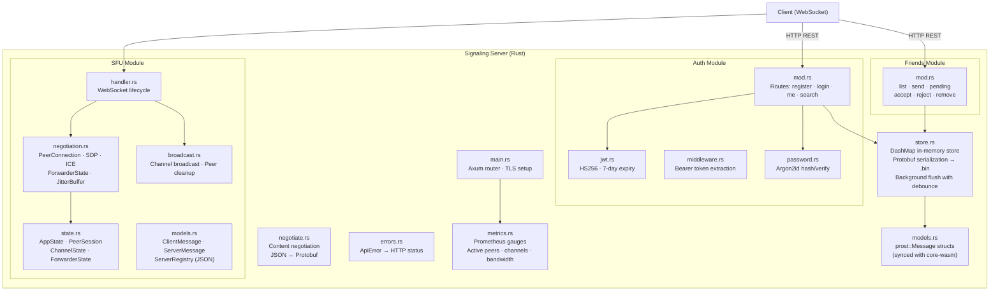
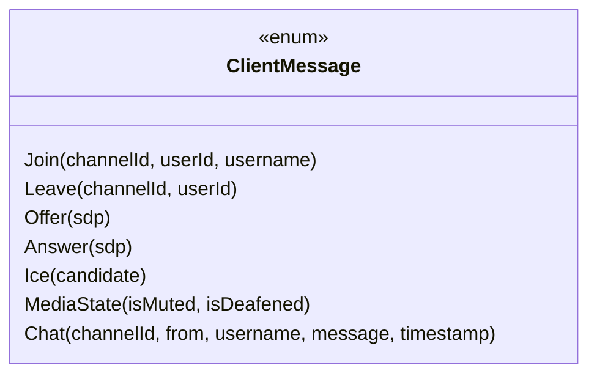
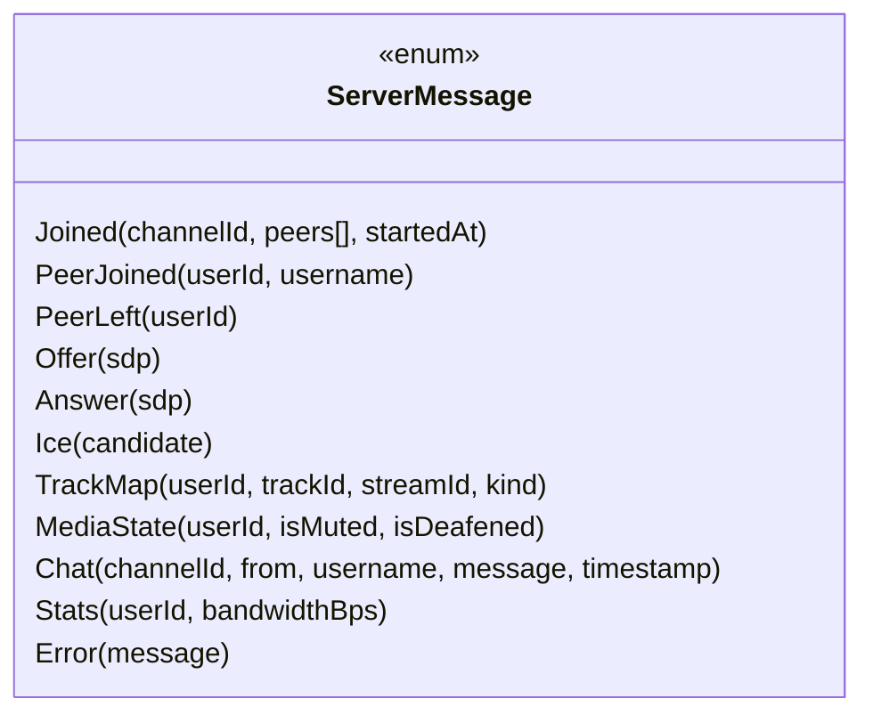
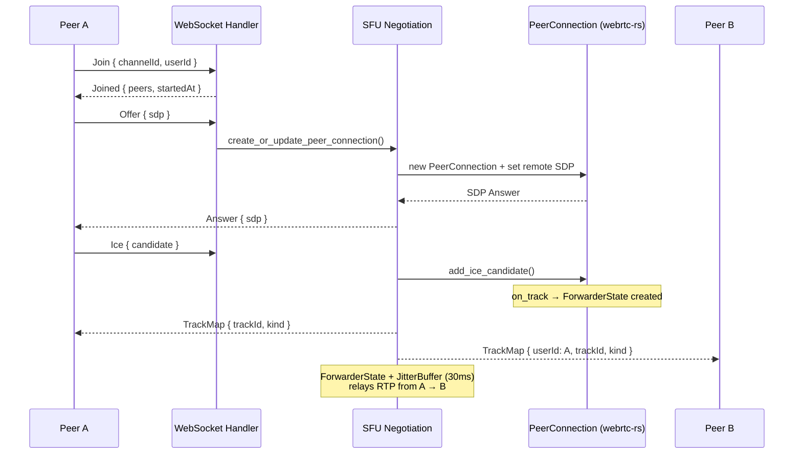
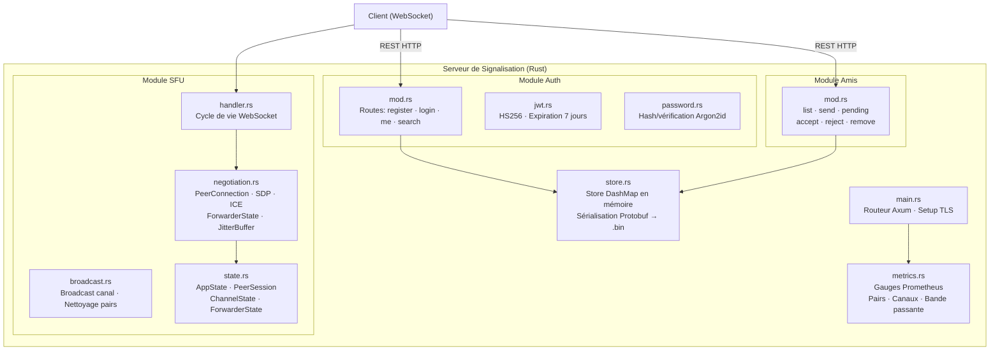
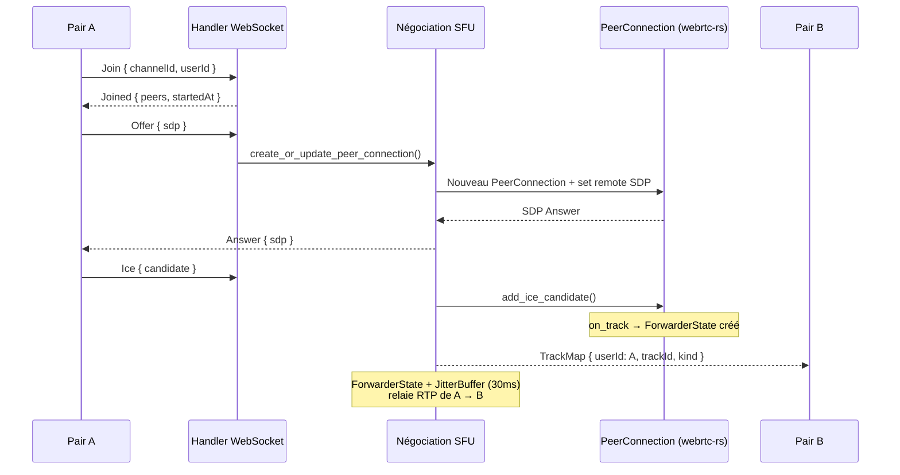

# Void — Signaling Server

High-performance WebRTC signaling server and SFU (Selective Forwarding Unit) written in **Rust** with **Axum**, **Tokio**, and **webrtc-rs**.


## Architecture



## Features

| Feature | Description |
|---|---|
| **SFU WebRTC** | Server-side PeerConnection via webrtc-rs, track forwarding |
| **JitterBuffer** | 30ms buffer at 48kHz for smooth RTP packet delivery |
| **Track Forwarding** | `ForwarderState` relays RTP packets between peers |
| **Catch-up** | Late joiners receive a single SDP offer with all existing tracks |
| **Auth** | Registration/login with Argon2id, JWT HS256 (7-day expiry) |
| **Friends** | Full CRUD: send/accept/reject requests, list/remove friends |
| **Content Negotiation** | Automatic JSON ↔ Protobuf based on `Accept`/`Content-Type` headers |
| **Protobuf Store** | In-memory DashMap, serialized to `.bin` via prost, background flush |
| **Prometheus Metrics** | Active peers, channels, bandwidth (ingress/egress) |
| **TLS** | Production: rustls with cert/key PEM files |
| **Real-time Chat** | WebSocket-based text messaging per channel |
| **Media State** | Mute/deafen broadcast in real-time |

## WebSocket Protocol

### Client → Server



### Server → Client



## SFU Flow



## REST API

### Auth (`/api/auth/`)

| Method | Endpoint | Auth | Description |
|---|---|---|---|
| POST | `/register` | — | Create account (username, password, display_name) |
| POST | `/login` | — | Login, returns JWT + UserProfile |
| GET | `/me` | Bearer | Get current user profile |
| PUT | `/me` | Bearer | Update display_name / avatar |
| GET | `/search?q=` | Bearer | Search users by username |

### Friends (`/api/friends/`)

| Method | Endpoint | Auth | Description |
|---|---|---|---|
| GET | `/` | Bearer | List all friends |
| POST | `/request` | Bearer | Send friend request |
| GET | `/pending` | Bearer | List pending requests |
| POST | `/accept` | Bearer | Accept a friend request |
| POST | `/reject` | Bearer | Reject a friend request |
| DELETE | `/:id` | Bearer | Remove a friend |

All endpoints support **protobuf** (`application/x-protobuf`) and **JSON** content negotiation.

## Prometheus Metrics

| Metric | Type | Description |
|---|---|---|
| `sfu_active_peers` | Gauge | Connected peers count |
| `sfu_active_channels` | Gauge | Active channels count |
| `sfu_bandwidth_egress_bps` | Gauge | Outbound bandwidth (bits/s) |
| `sfu_bandwidth_ingress_bps` | Gauge | Inbound bandwidth (bits/s) |
| `sfu_packets_per_second` | Histogram | RTP packets per second |

Endpoints: `GET /metrics`, `GET /health`

## Configuration

```bash
# .env
RUST_LOG=info    # Log level: debug, info, warn, error
DEV_MODE=1       # Set for HTTP-only dev mode (no TLS)
```

| Port | Protocol | Description |
|---|---|---|
| 3001 | TCP | HTTPS/WSS (Signaling + REST API) |
| 10000-20000 | UDP | WebRTC RTP/RTCP media |

## Build & Run

```bash
# Development (HTTP, no TLS)
DEV_MODE=1 cargo run

# Production (TLS required)
cargo build --release
./target/release/signaling-server

# ARM64 cross-compile
cargo build --release --target aarch64-unknown-linux-gnu
```

### TLS Certificates

```bash
openssl req -x509 -newkey rsa:4096 -keyout key.pem -out cert.pem \
  -sha256 -days 365 -nodes -subj "/C=FR/ST=PACA/L=LaGarde/O=Void/CN=<public_ip>"
```

## Docker

```bash
docker compose up -d --build
docker compose logs -f signaling-server
```

## File Structure

```
packages/signaling-server/
├── Cargo.toml
├── src/
│   ├── main.rs           # Axum setup, TLS, routes
│   ├── models.rs         # Protobuf message types (prost, synced with core-wasm)
│   ├── store.rs          # DashMap store + protobuf persistence
│   ├── negotiate.rs      # JSON ↔ Protobuf content negotiation
│   ├── metrics.rs        # Prometheus metrics + stats broadcaster
│   ├── errors.rs         # ApiError enum → HTTP responses
│   ├── auth/
│   │   ├── mod.rs        # Auth routes (register, login, me, search)
│   │   ├── jwt.rs        # JWT HS256 sign/verify
│   │   ├── middleware.rs # Bearer token extractor
│   │   └── password.rs   # Argon2id hash/verify
│   ├── friends/
│   │   └── mod.rs        # Friends CRUD routes
│   └── sfu/
│       ├── handler.rs    # WebSocket handler (message dispatch)
│       ├── negotiation.rs# PeerConnection, SDP, ICE, forwarders
│       ├── broadcast.rs  # Channel broadcast + peer cleanup
│       ├── models.rs     # WS protocol types (ClientMessage/ServerMessage)
│       └── state.rs      # AppState, PeerSession, ChannelState, JitterBuffer
```

## Dependencies

| Crate | Role |
|---|---|
| `axum` | HTTP/WebSocket framework |
| `tokio` | Async runtime |
| `webrtc` | WebRTC SFU (PeerConnection, RTP, ICE) |
| `prost` | Protobuf encode/decode |
| `dashmap` | Concurrent in-memory store |
| `argon2` | Password hashing |
| `jsonwebtoken` | JWT sign/verify |
| `prometheus` | Metrics exposition |
| `rustls` / `axum-server` | TLS termination |

## Security

| Layer | Protection |
|---|---|
| **Transport** | TLS 1.3 (rustls, AES-256) |
| **Media** | DTLS/SRTP for all WebRTC tracks |
| **Auth** | Argon2id password hashing, JWT Bearer |
| **Memory** | Rust memory safety — no buffer overflows |

## License

**BSL-1.1** — See [LICENSE](../../LICENSE).

---

# Void — Serveur de Signalisation (FR)

Serveur de signalisation WebRTC et SFU (Selective Forwarding Unit) haute performance écrit en **Rust** avec **Axum**, **Tokio** et **webrtc-rs**.

## Architecture



## Fonctionnalités

| Fonctionnalité | Description |
|---|---|
| **SFU WebRTC** | PeerConnection côté serveur via webrtc-rs, relais de tracks |
| **JitterBuffer** | Buffer de 30ms à 48kHz pour un acheminement RTP lissé |
| **Relais de Tracks** | `ForwarderState` relaie les paquets RTP entre pairs |
| **Catch-up** | Les retardataires reçoivent une seule offre SDP avec tous les tracks |
| **Auth** | Inscription/connexion Argon2id, JWT HS256 (7 jours) |
| **Amis** | CRUD complet : envoi/acceptation/rejet, liste/suppression |
| **Négociation de Contenu** | JSON ↔ Protobuf automatique selon les headers |
| **Store Protobuf** | DashMap en mémoire, sérialisé en `.bin` via prost |
| **Métriques Prometheus** | Pairs actifs, canaux, bande passante |
| **TLS** | Production : rustls avec fichiers PEM cert/key |

## Protocole WebSocket

### Client → Serveur

| Type | Champs | Description |
|---|---|---|
| `join` | channelId, userId, username | Rejoindre un canal |
| `leave` | channelId, userId | Quitter un canal |
| `offer` | sdp | Offre SDP WebRTC |
| `answer` | sdp | Réponse SDP |
| `ice` | candidate | Candidat ICE |
| `mediaState` | isMuted, isDeafened | État micro/casque |
| `chat` | channelId, from, message, timestamp | Message texte |

### Serveur → Client

| Type | Champs | Description |
|---|---|---|
| `joined` | channelId, peers[], startedAt | Confirmation d'entrée |
| `peerJoined` | userId, username | Nouveau pair |
| `peerLeft` | userId | Départ d'un pair |
| `offer` / `answer` | sdp | Échange SDP |
| `ice` | candidate | Candidat ICE |
| `trackMap` | userId, trackId, kind | Mapping des tracks |
| `mediaState` | userId, isMuted, isDeafened | État média |
| `stats` | userId, bandwidthBps | Statistiques réseau |

## Flux SFU



## API REST

### Auth (`/api/auth/`)

| Méthode | Endpoint | Auth | Description |
|---|---|---|---|
| POST | `/register` | — | Créer un compte |
| POST | `/login` | — | Connexion → JWT + UserProfile |
| GET | `/me` | Bearer | Profil de l'utilisateur courant |
| PUT | `/me` | Bearer | Mise à jour display_name / avatar |
| GET | `/search?q=` | Bearer | Recherche d'utilisateurs |

### Amis (`/api/friends/`)

| Méthode | Endpoint | Auth | Description |
|---|---|---|---|
| GET | `/` | Bearer | Liste des amis |
| POST | `/request` | Bearer | Envoyer une demande d'ami |
| GET | `/pending` | Bearer | Liste des demandes en attente |
| POST | `/accept` | Bearer | Accepter une demande |
| POST | `/reject` | Bearer | Rejeter une demande |
| DELETE | `/:id` | Bearer | Supprimer un ami |

## Compilation & Exécution

```bash
# Développement (HTTP, sans TLS)
DEV_MODE=1 cargo run

# Production (TLS requis)
cargo build --release
./target/release/signaling-server

# Compilation croisée ARM64
cargo build --release --target aarch64-unknown-linux-gnu
```

## Structure des Fichiers

```
packages/signaling-server/
├── Cargo.toml
├── src/
│   ├── main.rs           # Setup Axum, TLS, routes
│   ├── models.rs         # Types protobuf (prost, synchronisés avec core-wasm)
│   ├── store.rs          # Store DashMap + persistance protobuf
│   ├── negotiate.rs      # Négociation de contenu JSON ↔ Protobuf
│   ├── metrics.rs        # Métriques Prometheus + broadcaster de stats
│   ├── errors.rs         # Enum ApiError → réponses HTTP
│   ├── auth/             # Module d'authentification
│   ├── friends/          # Module de gestion des amis
│   └── sfu/              # Module SFU (handler, négociation, broadcast, state)
```

## Sécurité

| Couche | Protection |
|---|---|
| **Transport** | TLS 1.3 (rustls, AES-256) |
| **Média** | DTLS/SRTP pour tous les tracks WebRTC |
| **Auth** | Hachage Argon2id, JWT Bearer |
| **Mémoire** | Memory safety Rust — pas de buffer overflow |

## Licence

**BSL-1.1** — Voir [LICENSE](../../LICENSE).
